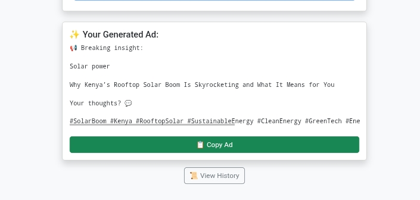

# Blog Ad Generator

A **robust and professional Flask-based application** that generates engaging blog ads with custom hashtags, saves them to a database, and allows editing and viewing ad history. Perfect for bloggers, marketers, and content creators who want to create compelling ad copy quickly.

---

## Features

- Generate blog ads using **title, description, platform**, and optional **custom hashtags**.
- Supports multiple platforms: Twitter, Facebook, WhatsApp, and general blogs.
- **Save all generated ads** into a SQLite database for tracking.
- **View ad history** in a dedicated dashboard.
- **Edit hashtags** directly from the history page, updating the ad instantly.
- Copy generated ads to clipboard with a single click.
- Built with **Flask**, **SQLAlchemy**, **Bootstrap**, and **JavaScript**.

---

## Demo

  


---

## Installation

1. **Clone the repository**

```bash
git clone https://github.com/arvineee/Ads-generator.git
cd Ads-generator
